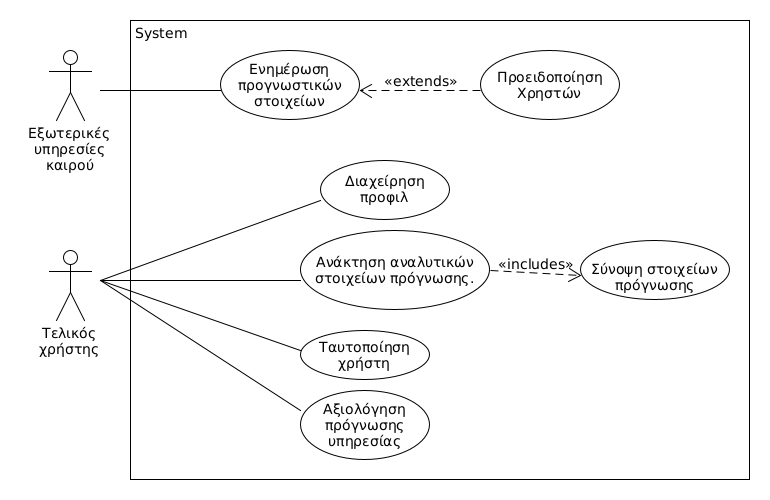
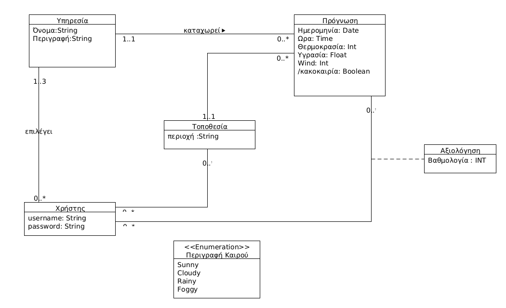

# Εισαγωγή

Στο παρών έγγραφο θα αναλυθούν όλες οι λειτουργικές και μη λειτουργικές απαιτήσεις συστήματος καθώς επίσης θα καταγραφεί και το μοντέλο χρήσης(use case model) του συστήματος προς υλοποίηση. 
Το σύστημα προς υλοποίηση αποτελεί μία εφαρμογή πρόγνωσης καιρού, και θα παρέχεται στον χρήστη σε μορφή REST API.

## Εμβέλεια

Το σύστημα θα :
* Παρέχει στον χρήστη πληροφορίες για την πρόγνωση του καιρού αν περιοχή.
* Δυνατότητα αναζήτησης καιρού ανά χρονική περίοδο.
* Δυνατότητα αξιολόγησης της υπηρεσίας που παρέχει την πρόγνωση του καιρού.
* Δυνατότητα δημιουργίας και επεξεργασίας profile.
* Δυνατότητα αποθήκευσης προτιμήσεων στο profile του.
* Δυνατότητα άντλησης στοιχείον από τρίτες υπηρεσίες.
* Δυνατότητα εγγραφής και ταυτοποίησης. 
Το σύστημα δεν θα παρέχει δυνατότητες:

* Γραφικού περιβάλλοντος / διεπαφής.
* Διαχειριστικό περιβάλλον.

## Ορισμοί ακρώνυμα και συντομογραφίες

## Αναφορές

Έννοια | Περιγραφή  
--|--
Χρήστης | Ο τελικός χρήστης του συστήματος. Μπορεί να είναι ένα φυσικό πρόσωπο ή ένα άλλο σύστημα
Εξωτερικές υπηρεσίες | Εξωτερικά μετεκλογικά συστήματα που επικοινωνούν με την εφαρμογή μας.
## Επισκόπηση

# Συνολική περιγραφή

### Υπηρεσία προγνωστικών καιρού.
Η υπηρεσία θα προσφέρει στους χρήστες τη δυνατότητα ενημέρωσης για προγνωστικά καιρού για περιοχές της επικράτειας αξιοποιώντας πολλαπλές πλατφόρμες πρόγνωσης (π.χ. Accuweather, ΕΜΥ, Meteo.gr). Μετά την εγγραφή και δημιουργία του προφίλ του στο σύστημα, ο χρήστης θα μπορεί να αναζητεί στοιχεία πρόγνωσης καιρού για συγκεκριμένες περιοχές. Τα στοιχεία πρόγνωσης θα αφορούν τον τρέχοντα καιρό, ωριαία πρόγνωση για τις επόμενες 3 ώρες και ημερήσια πρόγνωση για τις επόμενες 3 ημέρες με 3 προγνώσεις ανά ημέρα (στις 08:00, 15:00 και 21:00). Ο χρήστης θα έχει τη δυνατότητα λήψης αναλυτικών στοιχείων πρόγνωσης (η δυνατότητα λήψης αναλυτικών στοιχείων αναφέρεται στη λήψη μιας απόκρισης από το σύστημα που περιλαμβάνει δύο ή περισσότερες προγνώσεις, μια από κάθε υπηρεσία πρόγνωσης) ή συγκεντρωτικών που θα προκύπτουν από στάθμιση των δεδομένων των επιμέρους υπηρεσιών (π.χ. επιστροφή της πρόγνωσης με τον υψηλότερο αριθμό αξιολογήσεων από τους χρήστες). Ο χρήστης κατά τη δημιουργία του προφίλ του θα επιλέγει τις υπηρεσίες πρόγνωσης που θέλει να χρησιμοποιήσει. Ο χρήστης θα έχει τη δυνατότητα να αξιολογεί εκάστοτε πρόβλεψη σε κλίμακα 1 (καθόλου ικανοποιημένος) έως 5 (απόλυτα ικανοποιημένος). Οι αξιολογήσεις των χρηστών θα αξιοποιούνται για τον υπολογισμό της συγκεντρωτικής πρόβλεψης ανά περιοχή (ανάλογα με τις εκάστοτε αξιολογήσεις το σύστημα θα προτείνει στο χρήστη πρόβλεψη από την (ή τις) υπηρεσίες με το μεγαλύτερο σκορ). Για την αποδοτική απόκριση στις αναζητήσεις, το σύστημα θα λαμβάνει περιοδικά και θα αποθηκεύει τα στοιχεία προγνώσεων από όλες τις συνεργαζόμενες υπηρεσίες. Για το σκοπό αυτό θα παρέχει κατάλληλο API το οποίο θα καλείται από τις συνεργαζόμενες υπηρεσίες με σκοπό την ενημέρωση προγνώσεων ανά περιοχή, όταν προκύπτουν κάποιες αλλαγές σε αυτές. Τέλος, η εφαρμογή θα έχει την δυνατότητα αποστολής προειδοποιητικών μηνυμάτων στο χρήστη σε περίπτωση κακοκαιρίας (μόνο σε περιπτώσεις κινδύνου ζωής) για όλες τις περιοχές ενδιαφέροντος που έχει καταχωρίσει στο προφίλ τους

## Επισκόπηση μοντέλου περιπτώσεων χρήσης

Περίπτωση χρήσης | Περιγραφή
--|--
ΠΧ1 Ταυτοποίηση | Η περίπτωση χρήσης για την ταυτοποίηση του χρήστη. Συμπεριλαμβάνει το σύνδεση και την εγγραφή
ΠΧ2 Διαχείριση προφίλ | Η περίπτωσης χρήσης για την διαχείριση του προφίλ.
ΠΧ3 Ανάκτηση αναλυτικών στοιχείων πρόγνωσης | Η περίπτωση χρήσης για την ανάκτηση αναλυτικών στοιχείων.
ΠΧ4 Σύνοψη στοιχείων πρόγνωσης | Η περίπτωση χρήσης που σημπληρώνει την ΠΧ3 και δίνει μία σύνοψη.
ΠΧ5 Αξιολόγηση αναλυτικής πρόγνωσης υπηρεσίας | Η περίπτωση χρήσης που είναι για την αξιολόγηση μίας πρόγνωσης
ΠΧ6 Ενημέρωση στοιχείων προγνώσεων | Η περίπτωση χρήσης που είναι για την ενημέρωση στοιχείων από εξωτερικές πηγές.
## Υποθέσεις και εξαρτήσεις

Για την υλοποίηση του συστήματος θα χρειαστούν να γίνουν ορισμένες υποθέσεις.

1. Τα δεδομένα τα οποία περιγράφουν τον καιρό δεν θα ακολουθούν κάποιο συγκεκριμένο πρότυπο αλλά θα είναι με βάση απλοποιημένη μορφή αυτών.
2. Η διαδικασία της ενημέρωσης του χρήστη σταματάει στην διαδικασία της σύνδεσης του συστήματος μας με το εξωτερικό σύστημα αποστολής ενημερωτικών μηνυμάτων.   
3. Η τιμή της υγρασίας θα καταχωρείτε στο σύστημα μας ως ένας integer.
4. Ο χρήστης θα έχει τη δυνατότητα λήψης αναλυτικών ή συγκεντρωτικών στοιχειων πρόγνωσης από 3 διαφορετικές υπηρεσίες.

# Ειδικές Απαιτήσεις 

## Περιπτώσεις χρήσης

### Οι ενδιαφερόμενοι και οι ανάγκες τους

### Actors του συστήματος

#### [ΠΧ1 Ταυτοποίηση](uc1-user-identification.md)

#### [ΠΧ2 Διαχείρηση προφίλ](uc2-user-profile-administration.md)

#### [ΠΧ3 Ανάκτηση αναλυτικών στοιχείων πρόγνωσης](uc3-weather-search.md)

#### [ΠΧ4 Σύνοψη στοιχείων πρόγνωσης](uc4-weather-search-summary.md)

#### [ΠΧ5 Αξιολόγηση αναλυτικής πρόγνωσης υπηρεσίας](uc5-service-rating.md)

#### [ΠΧ6 Ενημέρωση στοιχείων προγνώσεων](uc6-update-weather-data.md) 

## Συμπληρωματικές προδιαγραφές

### Απαιτήσεις διεπαφών

#### Διεπαφές χρήστη
Το σύστημα δεν θα υποστηρίζει γραφική διεπαφή χρήστη. Η επικοινωνία θα γίνεται μέσο REST API.
#### Διεπαφές επικοινωνίας

Το σύστημα θα στέλνει προειδοποιητικά ηλεκτρονικά μηνύματα για περιπτώσεις έκτακτων καιρικών 
φαινομένων.

### Περιορισμοί σχεδίασης και υλοποίησης

Το σύστημα θα αναπτυχθεί σε Java με χρήση το Jersey framework.
### Ποιοτικά χαρακτηριστικά

#### Απόδοση 

* Το σύστημα θα πρέπει να είναι ικανό να εξυπηρετεί 500 χρήστες χωρίσ καμία καθυστέρηση.
 

#### Διαθεσιμότητα

* Το σύστημα θα πρέπει να είναι διαθέσιμο 24 ώρες 7 ημέρες το βδομάδα.
* Ο χρόνος μη διαθεσιμότητας θα πρέπει να είναι μικρότερος του 5%

#### Ασφάλεια
* Όλες οι λειτουργίες απαιτούν την αυθεντικό ποίηση του χρήστη.
* Το σύστημα θα πρέπει να φροντίζει ώστε να προστατεύεται η ιδιωτικότητα του πελάτη.

#### Ευχρηστία
* Ο χρήστης θα πρέπει να γνωρίζει από  http requests για να αξιοποιήσει το api.
## Μοντέλο πεδίου

